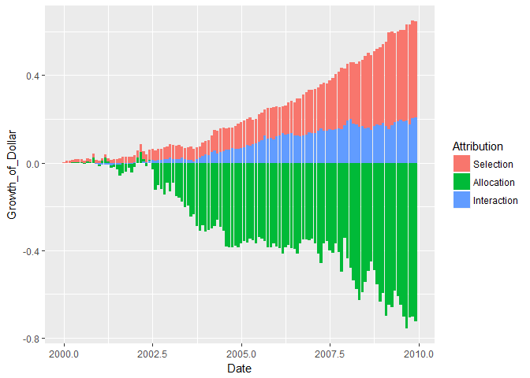
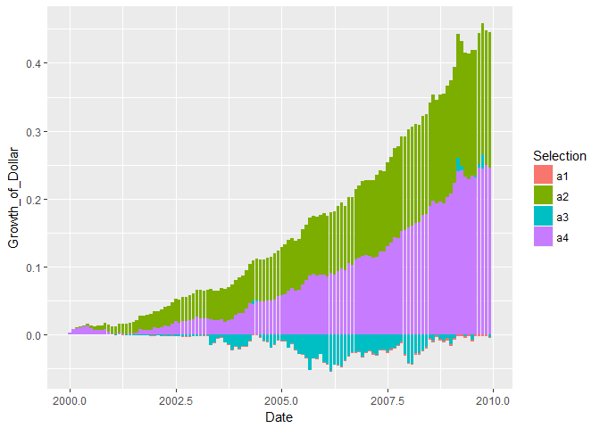
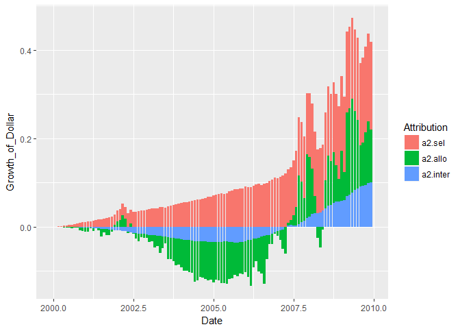
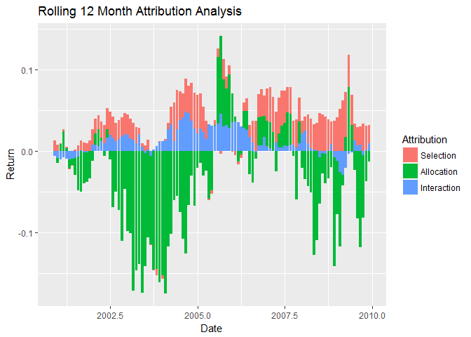

# Multi Period Performance Attribution
Karl Polen  
July 2, 2016  


```r
require(lubridate)
require(zoo)
#
# construct a hypothetical data set
#

n=120 # number of periods
set.seed(123)
timeline=as.Date("2000-1-1")+months(0:(n-1))
timeline=as.yearmon(timeline)
return.index=data.frame(i1=rnorm(n,.06/12,.08/sqrt(12)),
                        i2=rnorm(n,.09/12,.16/sqrt(12)),
                        i3=rnorm(n,.05/12,.05/sqrt(12)),
                        i4=rnorm(n,.1/12,.2/sqrt(12)),
                        i5=rnorm(n,.045/12,.09/sqrt(12)))
return.index=zoo(return.index,timeline)
return.actual=data.frame(a1=return.index$i1+rnorm(n,0,.0003),
                         a2=return.index$i2+rnorm(n,.003,.002),
                         a3=return.index$i3+rnorm(n,-.0005,.001),
                         a4=return.index$i4+rnorm(n,.003,.008))
asset.name=colnames(return.actual)
m=ncol(return.actual) # number of assets
return.actual=zoo(return.actual,timeline)
weight.policy=data.frame(w1=rep(.25,n),
                         w2=rep(.25,n),
                         w3=rep(c(.25,.15),c((n-50),50)),
                         w4=rep(c(.25,.35),c((n-50),50)))
weight.policy=zoo(weight.policy,timeline)
benchmark.policy=data.frame(pb1=rep(1,n),
                            pb2=rep(2,n),
                            pb3=rep(c(3,5),c(n-80,80)),
                            pb4=rep(4,n))
benchmark.policy=zoo(benchmark.policy,timeline)

return.benchmark=matrix(0,nrow=n,ncol=m)
for (i in 1:n) {
  return.benchmark[i,]=return.index[i,benchmark.policy[i,]]
}
return.benchmark=zoo(return.benchmark,timeline)

#
#  Define Functions
#

frong=function(atmat,rport,rben) {
  savetime=time(atmat)
  savename=colnames(atmat)
  rpcum=gd(as.numeric(rport))
  rben=as.numeric(rben)
  ans=atmat
  for (i in 2:nrow(atmat)) {
    ans[i,]=(ans[i,]*rpcum[i-1])+(rben[i]*colSums(ans[1:(i-1),]))
  }
  ans=zoo(ans,savetime)
  colnames(ans)=savename
  return(ans)
}

gd=function(x) {
  exp(cumsum(log(1+x)))
}

gdminus1=function(x,one=1) {
  temp=gd(x)
  temp-matrix(one,nrow=nrow(x),ncol=ncol(x),byrow=TRUE)
}

gdweight=function(x){
  temp=gd(x)
  temp/matrix(rowSums(temp),ncol=ncol(x),nrow=nrow(x))
}

#
# Do the analysis
#

asset.indollar=gd(return.actual)
termval=asset.indollar[n,]
asset.indollar=matrix(as.numeric(asset.indollar),ncol=4,nrow=n)
asset.indollar=zoo(rbind(rep(1,m),asset.indollar[-n,]),timeline)
colnames(asset.indollar)=asset.name
asset.inpercent=gdweight(asset.indollar)

#calculate returns
composite.actual=zoo(rowSums(return.actual*asset.inpercent),timeline)
composite.benchmark=zoo(rowSums(return.benchmark*weight.policy),timeline)

#Selection effect
selection=weight.policy*(return.actual-return.benchmark)
colnames(selection)=paste0(asset.name,".sel")

#allocation effect
allocation=return.benchmark*(asset.inpercent-weight.policy)
colnames(allocation)=paste0(asset.name,".allo")

#interaction effect
interaction=(return.actual-return.benchmark)*(asset.inpercent-weight.policy)
colnames(interaction)=paste0(asset.name,".inter")

attrib.df=merge(selection,allocation,interaction)

attrib.fr=frong(attrib.df,composite.actual,composite.benchmark)

#check result  -- sum of attrib.df should equal the difference between bench and actual returns
#check at tolerance of one tenth basis point
.00001>(sum(attrib.fr)-(gd(composite.actual)[n]-gd(composite.benchmark)[n]))
```

```
## Dec 2009 
##     TRUE
```

```r
#graph results in ggplot2
require(ggplot2)
require(reshape2)
#create some handy functions 
unzoo=function(x) {
  timetemp=as.numeric(time(x))
  nametemp=c("Date",colnames(x))
  ans=cbind(timetemp,as.data.frame(x))
  rownames(ans)=NULL
  colnames(ans)=nametemp
  return(ans)
}
sumdfbycol=function(x,byvec,namevec) {
  cname=colnames(x)
  savetime=time(x)
  x=as.array(x)
  ans=matrix(0,ncol=length(byvec),nrow=nrow(x))
  for(i in 1:length(byvec)) {
    ans[,i]=rowSums(x[,grep(byvec[i],cname)])
  }
  ans=zoo(ans,savetime)
  colnames(ans)=namevec
  return(ans)
}
gg=function(x,variable.name="Variable",value.name="Value") {
  melt(unzoo(x),id.vars="Date",
       variable.name=variable.name,
       value.name=value.name)
}


#plot a stacked bar chart of total portfolio growth of a dollar with attribution 
attrib.sum=sumdfbycol(attrib.fr,c(".sel",".allo",".inter"),
                      c("Selection","Allocation","Interaction"))
attrib.tf=merge(gd(composite.benchmark),cumsum(attrib.sum))
colnames(attrib.tf)[1]="Benchmark"
attrib.tf=gg(attrib.tf,"Attribution","Growth_of_Dollar")
attrpos=subset(attrib.tf,Growth_of_Dollar>=0)
attrneg=subset(attrib.tf,Growth_of_Dollar<0)
ggplot()+
  geom_bar(data=attrpos,aes(x=Date,y=Growth_of_Dollar,fill=Attribution),stat="identity")+
  geom_bar(data=attrneg,aes(x=Date,y=Growth_of_Dollar,fill=Attribution),stat="identity")
```

<!-- -->

```r
#plot just the cumulative attribution effects
attrib.sum=cumsum(attrib.sum)
attrib.sum=gg(attrib.sum,"Attribution","Growth_of_Dollar")
attrpos=subset(attrib.sum,Growth_of_Dollar>=0)
attrneg=subset(attrib.sum,Growth_of_Dollar<0)
ggplot()+
  geom_bar(data=attrpos,aes(x=Date,y=Growth_of_Dollar,fill=Attribution),stat="identity")+
  geom_bar(data=attrneg,aes(x=Date,y=Growth_of_Dollar,fill=Attribution),stat="identity")
```

<!-- -->

```r
#plot contributions to selection effect by asset
attrib.sel=attrib.fr[,grep(".sel",colnames(attrib.fr))]
colnames(attrib.sel)=asset.name
attrib.sel=cumsum(attrib.sel)
attrib.sel=gg(attrib.sel,"Selection","Growth_of_Dollar")
attrpos=subset(attrib.sel,Growth_of_Dollar>=0)
attrneg=subset(attrib.sel,Growth_of_Dollar<0)
ggplot()+
  geom_bar(data=attrpos,aes(x=Date,y=Growth_of_Dollar,fill=Selection),stat="identity")+
  geom_bar(data=attrneg,aes(x=Date,y=Growth_of_Dollar,fill=Selection),stat="identity")
```

<!-- -->

```r
#plot attribution analysis for asset "a2"
attrib.asset=attrib.fr[,grep("a2",colnames(attrib.fr))]
attrib.asset=cumsum(attrib.asset)
#attrib.asset=merge(gd(return.actual$a2),attrib.asset)
attrib.asset=gg(attrib.asset,"Attribution","Growth_of_Dollar")
attrpos=subset(attrib.asset,Growth_of_Dollar>=0)
attrneg=subset(attrib.asset,Growth_of_Dollar<0)
ggplot()+
  geom_bar(data=attrpos,aes(x=Date,y=Growth_of_Dollar,fill=Attribution),stat="identity")+
  geom_bar(data=attrneg,aes(x=Date,y=Growth_of_Dollar,fill=Attribution),stat="identity")
```

<!-- -->

```r
#a rolling attribution example--12 month roll grouped by attribution effect
roll.attr=function (attribmat,rollwidth,grouping,group.name,asset_return,bench_return) {
  xdf=zoo(1:nrow(attribmat),time(attribmat))
  rollfunction=function(x) {
    ans=frong(attribmat[x,],asset_return[x],bench_return[x])
    ans=sumdfbycol(ans,grouping,group.name)
    ans=colSums(ans)
    if(rollwidth>12) ans=-1+exp((12/rollwidth)*log(1+ans))
    return(ans)
  }
  rollapply(xdf,rollwidth,rollfunction,by.column=FALSE,align="right")
}

attribroll12=roll.attr(attrib.df,12,c(".sel",".allo",".inter"),
                      c("Selection","Allocation","Interaction"),
                      composite.actual,
                      composite.benchmark)
attribroll12gg=gg(attribroll12,"Attribution","Return")
attrpos=subset(attribroll12gg,Return>=0)
attrneg=subset(attribroll12gg,Return<0)
ggplot()+
  geom_bar(data=attrpos,aes(x=Date,y=Return,fill=Attribution),stat="identity")+
  geom_bar(data=attrneg,aes(x=Date,y=Return,fill=Attribution),stat="identity")+
  ggtitle("Rolling 12 Month Attribution Analysis")
```

<!-- -->

```r
attribroll36=roll.attr(attrib.df,36,c(".sel",".allo",".inter"),
                      c("Selection","Allocation","Interaction"),
                      composite.actual,
                      composite.benchmark)
attribroll36gg=gg(attribroll36,"Attribution","Return")
attrpos=subset(attribroll36gg,Return>=0)
attrneg=subset(attribroll36gg,Return<0)
ggplot()+
  geom_bar(data=attrpos,aes(x=Date,y=Return,fill=Attribution),stat="identity")+
  geom_bar(data=attrneg,aes(x=Date,y=Return,fill=Attribution),stat="identity")+
  ggtitle("Rolling 3 Year Attribution Analysis")
```

<!-- -->
